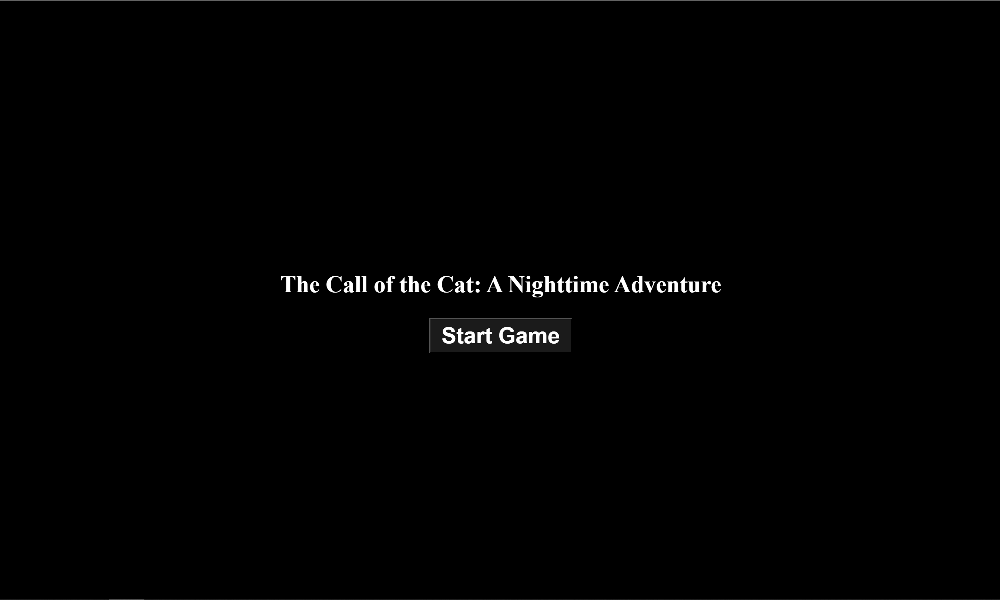

# 貓的呼喚：夜間冒險

<div style="text-align: center;"><a href="./doc/README-en.md">English</a></div>

這是一款有趣而頗具互動性的遊戲，你需要在遊戲中找到並點擊隨機出現的貓圖片，同時避免點擊其他動物圖片



## 如何玩

讓你的滑鼠在畫面上移動，聽動物的聲音，越靠近動物，聲音就越大  
點擊貓咪來得分，但要小心不要點擊其他動物，否則你將失去分數

享受這個夜間冒險，看看你能否找出所有貓咪

## 在本地運行

### 1. 複製專案到本地端

```bash
git clone https://github.com/Ryoukiwei/The-Call-of-the-Cat.git
```

請確保你的電腦有安裝 Git

### 2. 進入目錄

```bash
cd The-Call-of-the-Cat
```

### 3. 安裝 packages

```bash
npm install
```

請確保你的電腦有安裝 npm

若你是 Windows/Mac 用戶，安裝 Node.js 時將包含 npm  
若你是 Linux 用戶請根據自己發行版常用的管理器安裝 Node.js 以及 npm

### 4. 運行

```bash
npm run dev
```

之後使用瀏覽器打開下列網址

> <http://localhost:5173/>

## 特色

- 版本 1.0.3
  - 惡臭河狸的嗓門特別大聲，它將妨礙冒險者找到所有的貓咪
