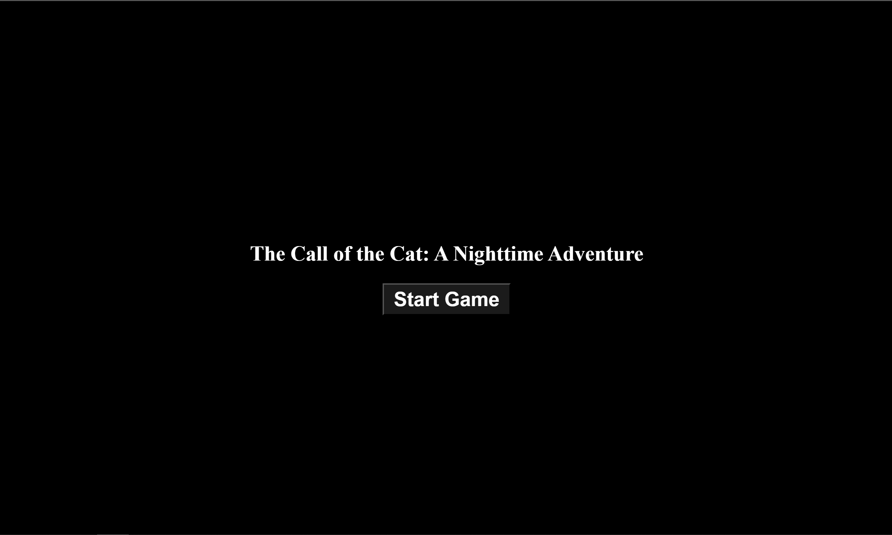

# The Call of the Cat: A Nighttime Adventure

This is a fun and interactive game where you need to find and click on randomly appearing cat images while avoiding clicking on other animal images.



## How to Play

Move your mouse around the screen to hear animal sounds. The closer you are to an animal, the louder the sound. Click on the cats to score points, but be careful not to click on other animals or you'll lose points.

Enjoy this nighttime adventure and see if you can find all the cats!

## Running Locally

### 1. Clone the Project to Your Local Machine

```bash
git clone https://github.com/Ryoukiwei/The-Call-of-the-Cat.git
```

Ensure that Git is installed on your computer.

### 2. Navigate to the Directory

```bash
cd The-Call-of-the-Cat
```

### 3. Install Packages

```bash
npm install
```

Ensure that npm is installed on your computer.

If you are a Windows/Mac user, npm will be included when you install Node.js.  
If you are a Linux user, please install Node.js and npm using your distribution's package manager.

### 4. Run

```bash
npm run dev
```

Then open the following URL in your browser:

> <http://localhost:5173/>

## Features

- Version 1.0.3
  - Tadokoro the beaver  will emit thunderous roars, impeding adventurers in their quest to find all the cats.
